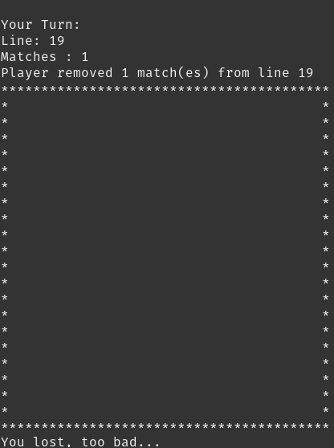

# Matchstick
My very first project with an Artificial Intelligence.

This AI is unbeatable, try it yourself ! 

### USAGE (in root directory):

1. Open a terminal in the ROOT directory (Matchstick/).

2. Enter the following command : `cd Matchstick && make re && ./matchstick 10 5` 
    to start the game with a grid of 10*10 and a maximum of 5 stick to remove each turn.

3. To modify the Game parameters, arguments must be entered as follow : 
    "./matchstick [nb_lines] [max_nb_matches_to_remove]"

- NOTE: 
Currently avaible on Linux OS only.

# Matchstick Preview
### Start Game

### Mid Game

### End Game

